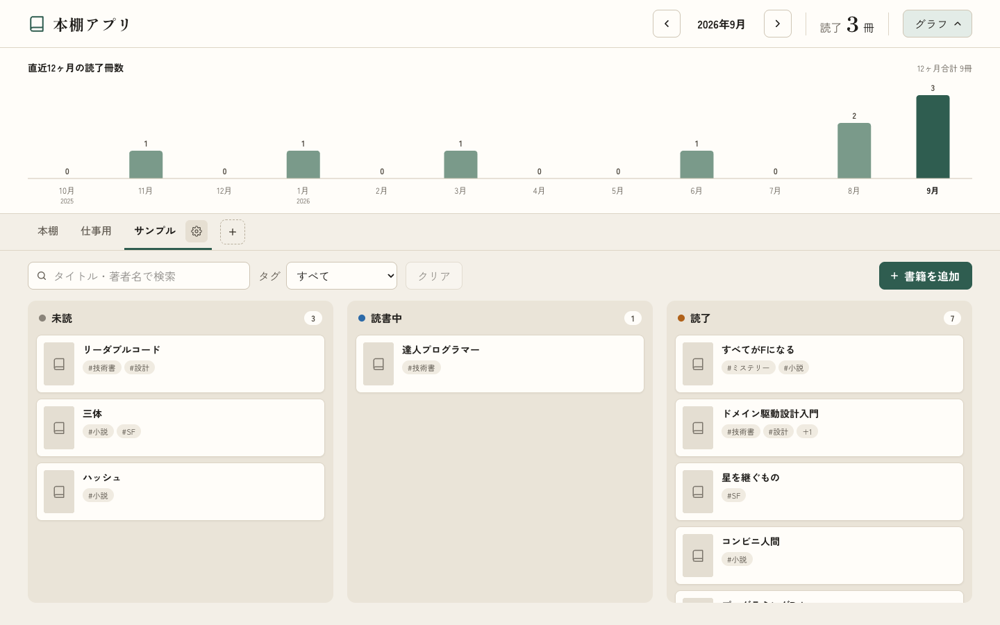

# 読書記録アプリ（本棚アプリ）

個人の読書記録を管理する、シンプルな本棚Webアプリケーション。スクール課題（初級編最終課題）として、指定技術スタック（Next.js / Ruby on Rails / MySQL）での要件定義〜設計〜実装を一人で経験することを主目的に開発した。

想定利用者は開発者本人のみ（1ユーザー）で、ログイン・認証機能は持たない。ローカル環境（Docker）だけで動かし、インターネットには公開しない。詳細は[要件定義書](docs/requirements.md)を参照。



## 主な機能

- 書籍の登録・編集・削除（タイトル・著者名・書影URL・ステータス・読書開始日・完了日・評価・タグ・感想メモ）
- 「未読」「読書中」「読了」の3列のボードと、ドラッグ&ドロップによるステータス変更・並べ替え
  - ステータスを変えると、読書開始日・完了日・評価を自動で更新する
- 月ごとの読了冊数（指定月の冊数＋直近12ヶ月のグラフ）
- 評価（星1〜5、読了の書籍のみ）・感想メモ
- 複数の本棚（作成・名前の変更・削除・切り替え、書籍の本棚間の移動）
- タグ（表記ゆれを同じタグとして扱う。例：「Ruby」「ruby」「ＲＵＢＹ」）
- 検索・絞り込み（タイトル・著者名のキーワード、タグ）

## 技術スタック

| レイヤー | 技術 |
|---|---|
| フロントエンド | Next.js 16（App Router、React 19） + TypeScript 6.0 + Tailwind CSS 4 / TanStack Query・dnd-kit・Recharts |
| バックエンド | Ruby 4.0 + Ruby on Rails 8.1（APIモード） |
| データベース | MySQL 8.4 |
| 開発環境 | Docker Compose（ローカルのみ） / GitHub Actions（CI） |

前回のTrello風アプリ（Java/Spring Boot + React/Vite + PostgreSQL）とは異なる技術スタックとする方針で選定した。バージョン・ライブラリの詳細と選定理由は[技術スタック詳細](docs/tech-stack.md)を参照。

## ディレクトリ構成

```
.
├── frontend/     # Next.js フロントエンド
├── backend/      # Ruby on Rails バックエンド（API）
├── docs/         # 要件定義・設計ドキュメント
├── compose.yaml  # 開発環境（Docker Compose）
└── .github/      # CI（GitHub Actions）
```

## 起動と停止

必要なもの：Docker（Docker Desktop など、Docker Compose が使えるもの）

### 初回

```bash
git clone https://github.com/okky0908-prog/bookshelf-app.git
cd bookshelf-app
cp .env.example .env      # DB のパスワードなどを設定する（そのままでも動く）
docker compose up         # db / backend / frontend を起動する
```

- 初回は Docker イメージの作成と gem・npm パッケージのインストールがあるため、数分かかる
- backend は起動時にデータベースを作成し、本棚「本棚」を1つ作る（`bin/rails db:prepare`）
- `backend-1` に `Listening on http://0.0.0.0:3001`、`frontend-1` に `Ready` と出たら、ブラウザで http://localhost:3000 を開く

### 2回目以降

| 内容 | コマンド |
|---|---|
| 起動する | `docker compose up`（ターミナルを占有しない場合は `docker compose up -d`） |
| 停止する | `Ctrl + C`（`-d` で起動した場合は `docker compose down`） |
| ログを見る（`-d` で起動した場合） | `docker compose logs -f backend frontend` |
| データをすべて消す | `docker compose down -v`（次の起動で、本棚「本棚」だけの状態に戻る） |

- データは Docker のボリューム（`db-data`）に保存され、停止・再起動しても消えない
- `git pull` で gem・npm パッケージが変わった場合は、`docker compose build` を実行してから起動する。データベースの変更（マイグレーション）は、起動時に自動で反映される

| サービス | URL |
|---|---|
| フロントエンド（画面） | http://localhost:3000 |
| バックエンド（API） | http://localhost:3001/api （稼働確認：http://localhost:3001/up） |
| MySQL | localhost:3306（`.env` の `DB_PORT` で変更可） |

- どのポートも、このPC（127.0.0.1）からの接続だけを受け付ける。APIには認証がないため、同じネットワークのほかの人からは接続できないようにしている（[tech-stack.md](docs/tech-stack.md) 6章）

### 困ったとき

| 症状 | 対処 |
|---|---|
| 画面に「サーバーに接続できませんでした。バックエンドが起動しているか確認してください」と出る | backend がまだ起動中か、止まっている。`docker compose ps` で `backend` が動いているか、`docker compose logs backend` でエラーが出ていないかを確認する |
| 起動時に `port is already allocated` と出る | 3000・3001・3306 のどれかをほかのアプリが使っている。MySQL（3306）なら `.env` の `DB_PORT` を変える（例：`3307`）。3000・3001 なら、使っているアプリを止める |
| `.env に DB_PASSWORD を設定してください` と出る | `.env` がない。`cp .env.example .env` を実行する |
| 画面の表示が古いまま変わらない | ブラウザを再読み込みする。直らなければ `docker compose restart frontend` |

## 使い方

画面は「本棚ボード」の1ページだけで、登録・編集・設定はモーダル（小さなウィンドウ）で行う。詳しい画面仕様は[画面設計書](docs/screens.md)を参照。

### 書籍を登録・編集する

- ［＋書籍を追加］で登録する。タイトル以外は省略できる。登録した書籍は、表示中の本棚の「未読」の列の末尾に入る
- カードをクリックすると編集できる。［削除］で削除する（確認のダイアログが出る）
- 書影URLに画像のURL（`https://` で始まるもの）を入れると、カードに表紙が表示される
- 完了日と評価は、ステータスが「読了」のときだけ入力できる
- タグは入力欄に書いて Enter で追加する。入力中は、似た名前の既存のタグが候補に出る（クリックで追加）
- 入力内容を変えたまま閉じようとすると、「変更を破棄しますか？」と確認される

### ステータスを変える（ドラッグ&ドロップ）

カードを別の列へドラッグすると、ステータスが変わる。同じ列の中でドラッグすると、並び順を変えられる。日付と評価は、次のように自動で変わる（編集モーダルでステータスを変えた場合も同じ）。

| 移動先 | 読書開始日 | 完了日 | 評価 |
|---|---|---|---|
| 読書中 | 空なら今日の日付を入れる | 消す | 消す |
| 読了 | 変えない | 今日の日付を入れる | 変えない |
| 未読 | 消す | 消す | 消す |

- 自動で入った日付は、あとから編集モーダルで直せる
- 感想メモとタグは、ステータスが変わっても消えない
- 検索・絞り込み中は、別の列へのドラッグだけができる（列の末尾に入る）。見えていない書籍があると並び順が正しく決まらないため、同じ列の中の並べ替えはできない

### 本棚を使い分ける

- 画面上部のタブで本棚を切り替える。表示中の本棚は URL（`?shelf=本棚のID`）にも入るので、再読み込みしても同じ本棚が表示される
- ［＋］で本棚を作成し、表示中のタブの［⚙］で名前の変更・削除ができる
- 書籍を別の本棚へ移すには、編集モーダルの「本棚」を変える
- 書籍が残っている本棚と、最後の1つの本棚は削除できない

### 探す・絞り込む

- 検索欄に入力すると、タイトルか著者名に含む書籍に絞り込む（英字の大文字・小文字、ひらがな・カタカナは区別しない）
- 「タグ」で、そのタグが付いた書籍に絞り込む。キーワードと両方を指定すると、両方に当てはまる書籍だけを表示する
- 絞り込み中は、列の見出しに「表示中の冊数 / 全冊数」を表示する。［クリア］で解除する

### 読んだ冊数を見る

- 画面右上に、指定した月の読了冊数（全本棚の合計）を表示する。［<］［>］で月を切り替える
- ［グラフ］で、今月を含む直近12ヶ月の読了冊数のグラフを開く。開いた状態はブラウザに保存され、次回も同じ状態で表示される
- 読了冊数は、完了日のある「読了」の書籍を、完了日の月で数える

## 開発

よく使うコマンド：

| 内容 | コマンド |
|---|---|
| Rails のテスト | `docker compose exec backend bundle exec rspec` |
| Rails のコードチェック | `docker compose exec backend bin/rubocop` |
| Rails のコンソール | `docker compose exec backend bin/rails console` |
| フロントエンドのテスト | `docker compose exec frontend npm test` |
| フロントエンドのコードチェック | `docker compose exec frontend npm run lint` |
| フロントエンドの型チェック | `docker compose exec frontend npm run typecheck` |
| gem・npm パッケージを追加したあと | `docker compose build` を実行してから `docker compose up` |

PR を作成すると、GitHub Actions で frontend（Prettier・ESLint・型チェック・Vitest・ビルド）と backend（RuboCop・RSpec）のチェックが実行される。

### エディタ（Cursor / VS Code）の準備

リポジトリ直下のフォルダではなく、ワークスペースファイル `bookshelf-app.code-workspace` を開いて作業する（ファイル → ファイルでワークスペースを開く）。backend・frontend・ルート（docs など）が別々のフォルダとして開かれ、Ruby LSP が `backend/Gemfile` を正しく使えるようになる。

- 推奨の拡張機能（Prettier・ESLint・Tailwind CSS・Ruby LSP）のインストールが提案されるので、インストールする
- 保存時に、frontend のファイルは Prettier、backend の Ruby のファイルは RuboCop で整形される（設定はワークスペースファイルにまとめている）

Ruby LSP を使うには、Mac 側にも Ruby と gem を入れる（アプリの実行には不要。Docker の中で動く）。

```bash
brew install rbenv ruby-build libyaml openssl@3 mysql-client@8.4
rbenv install 4.0.7       # backend/.ruby-version と同じバージョン
cd backend
bundle config set --local build.mysql2 "--with-mysql-config=$(brew --prefix mysql-client@8.4)/bin/mysql_config"
bundle install
```

`~/.zshrc` に `eval "$(rbenv init - zsh)"` を追記しておく。

### 開発ルール

Issue作成 → ブランチ作成 → コミット → PR作成の運用ルールは[CLAUDE.md](CLAUDE.md)を参照。

## ドキュメント

| ドキュメント | 内容 |
|---|---|
| [要件定義書](docs/requirements.md) | 機能要件・非機能要件、決めたことと理由 |
| [画面設計書](docs/screens.md) | 画面の構成・操作、モックアップ |
| [DB設計書](docs/database.md) | テーブル定義、並び順・ステータス変更時の扱い |
| [API設計書](docs/api.md) | エンドポイント、リクエスト・レスポンス、エラーの形式 |
| [技術スタック詳細](docs/tech-stack.md) | バージョン、ライブラリ、構成、選定理由 |

## 現在の進捗状況

- [x] 要件定義（機能要件・非機能要件）
- [x] 基本設計（画面・DB・API・技術スタック）
- [x] フロントエンド／バックエンドの環境構築
- [x] 実装（MVP の機能はすべて実装済み）
  - [x] バックエンドの API（API-01〜12）
  - [x] 本棚ボード画面（集計・本棚タブ・検索・3列のボード）
  - [x] 書籍の登録・編集モーダル、本棚の作成・設定モーダル、削除の確認
  - [x] ドラッグ&ドロップ
  - [x] 直近12ヶ月のグラフ
