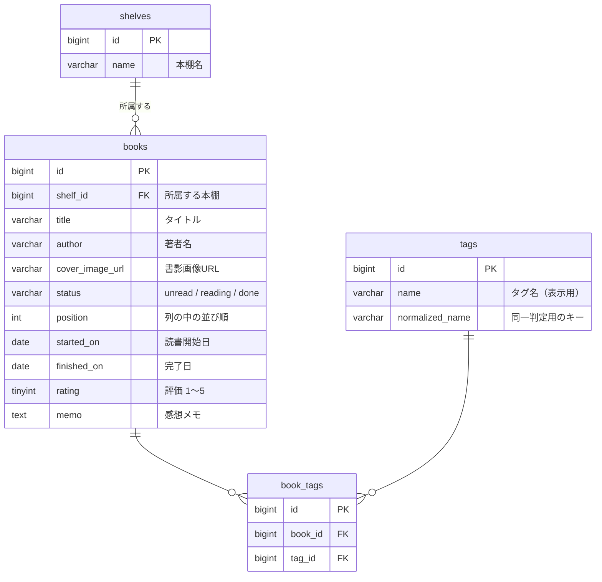

# DB設計書：読書記録アプリ（本棚アプリ）

要件定義書（[requirements.md](requirements.md)）と画面設計書（[screens.md](screens.md)）をもとに、データベースのテーブル構成・制約・データの扱い方を定める。

## 1. 概要

- データベースは MySQL 8.0、文字コードは `utf8mb4` とする
- テーブルは `shelves`（本棚）、`books`（書籍）、`tags`（タグ）、`book_tags`（書籍とタグの中間テーブル）の4つ
- Rails の規約に従い、各テーブルの主キーは `id`（bigint、自動採番）とし、`created_at` / `updated_at`（datetime）を持たせる（以下の表では省略する）
- 列名はRailsの慣習に合わせ、日付は `〜_on`（date型）、外部キーは `〜_id` とする

## 2. ER図



- 本棚と書籍は1対多（書籍は必ず1つの本棚に所属する。要件定義書5.6）
- 書籍とタグは多対多（1冊に複数のタグ、1つのタグを複数の書籍で使う。要件定義書5.7）。中間テーブル `book_tags` でつなぐ

## 3. テーブル定義

### 3.1 shelves（本棚）

| 列名 | 型 | NULL | 初期値 | 説明 |
|---|---|---|---|---|
| id | bigint | × | 自動採番 | 主キー |
| name | varchar(50) | × | | 本棚名 |

- 本棚タブの並びは作成順（`id` の昇順）とする（画面設計書4.2）
- 本棚名の重複は許可する（要件で禁止していないため）

### 3.2 books（書籍）

| 列名 | 型 | NULL | 初期値 | 説明 |
|---|---|---|---|---|
| id | bigint | × | 自動採番 | 主キー |
| shelf_id | bigint | × | | 所属する本棚（`shelves.id`） |
| title | varchar(255) | × | | タイトル |
| author | varchar(255) | ○ | NULL | 著者名 |
| cover_image_url | varchar(2048) | ○ | NULL | 書影画像URL |
| status | varchar(10) | × | `'unread'` | ステータス。`unread`（未読）／`reading`（読書中）／`done`（読了） |
| position | int | × | | 列の中の並び順（1からの連番。5章） |
| started_on | date | ○ | NULL | 読書開始日 |
| finished_on | date | ○ | NULL | 完了日 |
| rating | tinyint | ○ | NULL | 評価（1〜5）。NULLは未評価 |
| memo | text | ○ | NULL | 感想メモ |

- ボードの「列」は `(shelf_id, status)` の組み合わせで決まる
- Rails では `enum :status, { unread: "unread", reading: "reading", done: "done" }` のように、文字列を値とする enum で扱う

### 3.3 tags（タグ）

| 列名 | 型 | NULL | 初期値 | 説明 |
|---|---|---|---|---|
| id | bigint | × | 自動採番 | 主キー |
| name | varchar(30) | × | | タグ名。画面に表示する名前で、最初に作成したときの表記のまま保存する |
| normalized_name | varchar(100) | × | | 同じタグかどうかを判定するためのキー（3.3.1）。一意。NFKC正規化で文字数が増える場合がある（例：「㍻」→「平成」）ため、`name` より長くしておく |

- タグは全本棚で共通とする（要件定義書5.7）
- `normalized_name` の照合順序は `utf8mb4_bin` とする。表記ゆれはアプリ側の正規化でそろえ、DBでは正規化後の文字列が完全に一致するかだけを見る

#### 3.3.1 表記ゆれの扱い（正規化）

タグ名は次の手順で正規化し、`normalized_name` が同じであれば同じタグとみなす。

| 順番 | 処理 | 例 |
|---|---|---|
| 1 | 前後の空白を取り除き、連続する空白を1つにする | `" SF  小説 "` → `"SF 小説"` |
| 2 | Unicode正規化（NFKC）で、全角英数字・記号を半角に、半角カタカナを全角にそろえる | `"ＲＵＢＹ"` → `"RUBY"`、`"ﾐｽﾃﾘｰ"` → `"ミステリー"` |
| 3 | 英字を小文字にそろえる | `"RUBY"` → `"ruby"` |
| 4 | カタカナをひらがなにそろえる | `"ミステリー"` → `"みすてりー"` |

- 例：「Ruby」「ruby」「ＲＵＢＹ」はすべて `ruby` になり、同じタグとして扱う。「ミステリー」「みすてりー」「ﾐｽﾃﾘｰ」も同じタグになる
- 同じタグがすでにある場合は新しく作らず、既存のタグを付ける。表示は既存のタグの `name`（最初に作成したときの表記）を使う
- 漢字の読み（「小説」と「しょうせつ」）や、意味が近い言葉（「SF」と「サイエンスフィクション」）は同じタグとみなさない
- 正規化はフロントエンド（入力候補の表示）とバックエンド（保存時の判定）で同じルールを使う

#### 3.3.2 似たタグの候補表示

- 編集モーダルのタグ入力欄では、入力した文字を正規化し、その文字列を `normalized_name` に**含む**既存タグを候補として表示する（部分一致）
  - 例：「ミステリ」と入力すると「ミステリー」「ミステリー小説」が候補に出る。「ruby」と入力すると「Ruby」「Ruby on Rails」が候補に出る
- 候補を選ばずにEnterを押した場合は、正規化後の名前が完全に一致するタグがあればそれを付け、なければ新しいタグを作る。部分一致しただけのタグには自動でまとめない（「SF」と「SF漫画」のように、分けて使いたいタグがあるため）
- タグの数は多くても数百件の想定のため、`LIKE '%…%'` による検索、またはタグ一覧をまとめて取得してフロントエンドで絞り込む方法で十分に速い

### 3.4 book_tags（書籍とタグの中間テーブル）

| 列名 | 型 | NULL | 初期値 | 説明 |
|---|---|---|---|---|
| id | bigint | × | 自動採番 | 主キー |
| book_id | bigint | × | | 書籍（`books.id`） |
| tag_id | bigint | × | | タグ（`tags.id`） |

## 4. 制約・インデックス

### 4.1 CHECK制約（books）

| 制約名 | 条件 | 目的 |
|---|---|---|
| chk_books_status | `status IN ('unread', 'reading', 'done')` | ステータスの値を3種類に限る |
| chk_books_rating | `rating IS NULL OR rating BETWEEN 1 AND 5` | 評価を1〜5の整数に限る |
| chk_books_done_only | `status = 'done' OR (finished_on IS NULL AND rating IS NULL)` | 完了日・評価は読了の書籍だけが持つ（要件定義書5.1・5.3） |
| chk_books_unread_no_start | `status <> 'unread' OR started_on IS NULL` | 未読の書籍は読書開始日を持たない（要件定義書5.3） |

- 読了の書籍でも、完了日・評価が空の状態は許可する（完了日を消した書籍は月間集計の対象外になる。要件定義書5.4）
- 「未読→読了」へ直接移動した書籍は、読書開始日が空のまま読了になる（要件定義書5.3）。これも許可する

### 4.2 外部キー

| 列 | 参照先 | 削除時の動作 | 理由 |
|---|---|---|---|
| books.shelf_id | shelves.id | RESTRICT | 書籍が残っている本棚は削除できない（要件定義書5.6）。アプリ側でも削除前に確認する |
| book_tags.book_id | books.id | CASCADE | 書籍を削除したら、その書籍のタグ付けも消す |
| book_tags.tag_id | tags.id | CASCADE | タグを削除したら、そのタグ付けも消す（MVPにタグの削除機能はないが、整合性のために設定する） |

### 4.3 一意制約・インデックス

| テーブル | 列 | 種類 | 用途 |
|---|---|---|---|
| books | (shelf_id, status, position) | インデックス | ボードの表示（本棚ごと・列ごとに並び順で取得する） |
| books | (status, finished_on) | インデックス | 月間集計 |
| tags | normalized_name | 一意 | 表記ゆれを含めて、同じタグを重複して作らない（要件定義書5.7） |
| book_tags | (book_id, tag_id) | 一意 | 同じ書籍に同じタグを二重に付けない |
| book_tags | tag_id | インデックス | タグでの絞り込み |

- `books.shelf_id` 単体の外部キー用インデックスは、(shelf_id, status, position) の複合インデックスで代用できるため作らない
- `(shelf_id, status, position)` に一意制約は付けない。並び順を振り直す途中で一時的に値が重複するため（5章）

## 5. 並び順（position）の扱い

- `position` は、同じ列（同じ `shelf_id` と `status`）の中での 1 からの連番とする
- ボードは `ORDER BY position` で取得する

| 操作 | position の変化 |
|---|---|
| 新規登録 | 表示中の本棚の「未読」列の末尾（その列の最大値＋1）に入れる |
| 列の中での並べ替え | その列の書籍の position を 1 から振り直す |
| 別の列へのドラッグ&ドロップ | 移動先の列はドロップした位置に入れて振り直し、移動元の列も詰めて振り直す |
| 絞り込み中の別の列へのドロップ | 移動先の列の末尾に入れ、移動元の列を詰めて振り直す（画面設計書4.4） |
| 編集モーダルでの本棚・ステータスの変更 | 移動先の列の末尾に入れ、移動元の列を詰めて振り直す（要件定義書5.6） |
| 削除 | その列を詰めて振り直す |

- 振り直しは1つのトランザクションで行い、対象の列の行を `SELECT ... FOR UPDATE` でロックしてから更新する
- 1つの列の書籍は多くても数百冊のため、毎回すべて振り直しても性能上の問題はない（要件定義書7章）

## 6. ステータス変更時のデータ更新

要件定義書5.3のルールを、列の値の変化として表す。ドラッグ&ドロップでも編集モーダルでも同じルールを適用する。

| 変更後 | started_on | finished_on | rating |
|---|---|---|---|
| reading（読書中） | NULLなら今日の日付を入れる。値があれば変更しない | NULLにする | NULLにする |
| done（読了） | 変更しない | 今日の日付を入れる | 変更しない |
| unread（未読） | NULLにする | NULLにする | NULLにする |

- `memo` とタグは、ステータスが変わっても変更しない
- 本棚の移動（`shelf_id` の変更）では、ステータス・日付・評価・感想メモ・タグは変更しない

## 7. 月間集計の方法

集計用のテーブルは持たず、表示のたびに `books` から数える。

```sql
-- 直近12ヶ月（例：2025年10月〜2026年9月）の月別読了冊数
SELECT DATE_FORMAT(finished_on, '%Y-%m') AS ym, COUNT(*) AS count
FROM books
WHERE status = 'done'
  AND finished_on >= '2025-10-01'
  AND finished_on <  '2026-10-01'
GROUP BY ym;
```

- 集計対象は全本棚の合計とする（`shelf_id` で絞り込まない。要件定義書5.4）
- 読了が0冊の月は結果に含まれないため、アプリ側で0として補う
- 指定月の冊数も同じ条件（範囲を1ヶ月にする）で数える

## 8. 初期データ

- 最初に起動したとき、本棚「本棚」を1つ作成する（要件定義書5.6）
- Rails の `db/seeds.rb` で、本棚が1つもない場合だけ作成する

## 9. 入力チェック（文字数上限）

| 項目 | 上限 | 必須 | 補足 |
|---|---|---|---|
| 本棚名 | 50文字 | ○ | 空白だけの場合は未入力として扱う |
| タイトル | 255文字 | ○ | 同上 |
| 著者名 | 255文字 | － | |
| 書影画像URL | 2048文字 | － | `http://` または `https://` で始まること |
| タグ名 | 30文字 | － | 前後の空白を取り除いてから判定する。同じタグかどうかは3.3.1の正規化で判定する |
| 感想メモ | 10,000文字 | － | `text` 型に保存し、上限はアプリ側で確認する |
| 評価 | 1〜5の整数 | － | 読了の書籍のみ |

- 入力チェックはフロントエンド（入力欄の下にエラーを表示。画面設計書8章）とバックエンド（Railsのバリデーション）の両方で行う

## 10. 設計上の判断とその理由

| 論点 | 採用した設計 | 検討した他の案 | 採用理由 |
|---|---|---|---|
| 並び順の持ち方 | 整数の連番。変更のたびに列ごと振り直す | 間隔を空けた整数（1000, 2000…）／小数・文字列キー（LexoRank等） | 仕組みが単純で、DBを見れば並び順がそのままわかる。個人利用の規模（1列あたり多くても数百冊）なら、毎回振り直しても性能に問題はない。他の案は更新が1行で済むが、値が詰まったときの振り直しや値の生成が必要になり、規模に対して複雑すぎる |
| position の一意制約 | 付けない | (shelf_id, status, position) に一意制約を付ける | 振り直しの途中で一時的に同じ値が生じ、更新の順番を工夫しないとエラーになる。並び順の正しさは、トランザクションと行ロックで守る |
| ステータスの持ち方 | 文字列＋CHECK制約（Railsは文字列のenum） | 整数（Rails標準のenum）／MySQLのENUM型 | DBを直接見ても値の意味がわかる。整数は意味がわからず、ENUM型は値を追加するたびにテーブル定義の変更が必要で、Railsとの相性もよくない |
| 列（未読・読書中・読了）の持ち方 | 書籍の `status` で表す | 列を表すテーブル（columns）を作る | 列は3つで固定され、本棚ごとに変わらない。テーブルにすると、本棚を作るたびに3つの列を作る処理が必要になる |
| タグの持ち方 | tags テーブル＋中間テーブル | 書籍にタグ名をカンマ区切り・JSONで持たせる | タグの重複防止（一意制約）、タグでの絞り込み、既存タグの候補表示がSQLで素直に書ける |
| タグ名の同一判定 | 大文字・小文字、全角・半角、ひらがな・カタカナの違いは同じタグとみなす | 完全一致のみ同じとみなす／部分一致するタグも同じとみなす | 完全一致だけでは「Ruby」と「ruby」のような表記ゆれで同じ意味のタグが増え、タグで絞り込んでも本が見つからなくなる。一方、部分一致までまとめると「SF」と「SF漫画」のように分けたいタグまで1つになってしまう。部分一致するタグは候補に表示して、使う人が選べるようにした |
| 表記ゆれをそろえる場所 | アプリで正規化し、`normalized_name` 列に保存して一意制約を付ける | MySQLの照合順序（大文字・小文字やかなの違いを区別しないもの）に任せる | 照合順序ごとに、同じとみなす文字の組み合わせが細かく異なり、どの文字がまとめられるかがわかりにくい。正規化のルールを自分たちで決めて列に保存すれば、ルールが明確で、フロントエンドの候補表示にも同じルールを使える |
| タグの表示名 | 最初に作成したときの表記を使う | 正規化した文字列（`ruby`、`みすてりー`）を表示する | 正規化した文字列は判定のためのもので、そのまま表示すると読みにくい（カタカナのタグがひらがなで表示される等）ため |
| どの書籍にも付いていないタグ | 削除せず、候補として残す | 最後の1冊から外れたら自動で削除する | 一時的に外しただけのタグが消えると、また作り直す手間がかかる。タグの削除機能はMVPの範囲外とする |
| 月間集計 | 表示のたびに books から数える | 月別の集計テーブルを持つ | 書籍は数百件程度なので、毎回数えても十分速い。集計テーブルを持つと、完了日の修正やステータスの変更のたびに更新が必要になり、値がずれる原因になる |
| データの整合性の守り方 | アプリのバリデーションに加えて、DBのCHECK制約・外部キーでも守る | アプリ側だけで守る | 実装の誤りや手作業でのデータ修正があっても、読了でない書籍に評価が残るといった矛盾したデータが保存されないようにするため（MySQL 8.0.16以降はCHECK制約が有効） |
| 本棚の削除制限 | 外部キーを RESTRICT にし、アプリ側でも確認する | CASCADE（書籍ごと削除） | 誤操作で多くの読書記録が一度に消えるのを防ぐ（要件定義書10章） |
| 日付の型 | date型 | datetime型 | 読書開始日・完了日は「日」の単位で記録すれば十分で、時刻やタイムゾーンを考えなくて済む |
