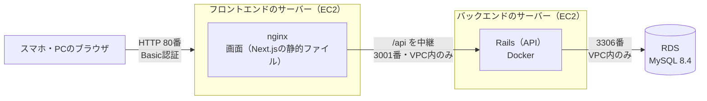

# インフラ構成：AWSへのデプロイ

本アプリを AWS 上にデプロイした際の構成と運用をまとめる。

当初は「ローカル環境のみ」で動かす方針だったが（[要件定義書](requirements.md) 7章）、学習目的（Terraform による構築と、実際のデプロイの経験）で AWS 上にも公開した。構築・変更はすべて Terraform（`infra/` 配下）で行っており、**構成の正確な内容はコードを参照する**。本ドキュメントは全体の構成と設計方針をつかむためのもので、IP アドレスや AMI ID など、`terraform apply` のたびに変わる値は書かない。

構成は、前回のタスク管理アプリ（`github-demo`）の AWS 構成をもとにし、フロントエンドとバックエンドを別々のサーバーに分けた。

## 全体構成



- ブラウザからのリクエストは、フロントエンドのサーバーの nginx が 80番で受ける。サイト全体（画面と API）に Basic 認証をかける
- nginx は画面のファイルを直接返し、`/api` だけをバックエンドのサーバー（プライベートIPの 3001番）へ中継する。ブラウザからは1つのサーバーに見えるため、CORS の設定はいらない
- バックエンドのサーバーと RDS は、インターネットから直接接続できない

## 構成要素

| 要素 | 方針 |
|---|---|
| リージョン | 東京（ap-northeast-1） |
| フロントエンドのサーバー | EC2（Amazon Linux 2023、t3.micro）。nginx で Next.js の静的ファイル（`output: "export"`）を返し、`/api` をバックエンドへ中継する |
| バックエンドのサーバー | EC2（Amazon Linux 2023、t3.micro）。Rails を Docker で動かす（Amazon Linux 2023 に Ruby 4.0 のパッケージがないため。前回は Java を直接インストールしていた） |
| データベース | RDS for MySQL 8.4（db.t3.micro、20GB、シングルAZ）。`publicly_accessible = false` でインターネットに公開しない |
| 公開IP | 自動で割り当てるものを使い、Elastic IP は使わない。EC2 を起動するたびに変わる |
| ネットワーク | 既定の VPC を使う（Terraform を実行する IAM ユーザーに、VPC・サブネットを作る権限を付けていない） |
| 秘密の値 | DB のパスワードと Basic 認証のパスワードは `infra/terraform.tfvars`、Rails の `SECRET_KEY_BASE` はバックエンドのサーバー上でだけ作る。どれもリポジトリには入れない |

### セキュリティグループ

送信元は IP アドレスではなく、できるだけセキュリティグループ単位で絞る。

| 対象 | 受け付ける接続 |
|---|---|
| フロントエンドのサーバー | HTTP（80番）：誰からでも（スマホのモバイル回線からも使えるように）。SSH（22番）：自分のPCのIPからだけ |
| バックエンドのサーバー | Rails（3001番）：フロントエンドのサーバーのセキュリティグループからだけ。SSH（22番）：自分のPCのIPからだけ |
| RDS | MySQL（3306番）：バックエンドのサーバーのセキュリティグループからだけ |

- アプリにはログイン機能がないため、HTTP を全世界に公開する代わりに、nginx の Basic 認証でサイト全体を守る
- ドメイン名がなく HTTPS にしていないため、Basic 認証のパスワードは暗号化されずに送られる。通りすがりのアクセスを防ぐためのもので、強い守りではない（今後の課題）

## 本番用の設定

前回の Spring Boot の `application-production.yml` にあたるものは、Rails では次のファイルになる。

| 役割 | ファイル | 内容 |
|---|---|---|
| 本番での動き | `backend/config/environments/production.rb` | HTTP で動かすため、HTTPS の強制（`force_ssl`）を環境変数 `FORCE_SSL` で切り替えられるようにした（既定はオフ） |
| DB の接続先 | `backend/config/database.yml`（`production`） | RDS のホスト・ユーザー名・パスワード・DB名を環境変数（`DB_HOST`・`DB_USERNAME`・`DB_PASSWORD`・`DB_NAME`）で受け取る |
| 環境変数の値 | バックエンドのサーバーの `/opt/bookshelf/backend.env` | `infra/deploy.sh` が、Terraform の出力値と `terraform.tfvars` から作る（権限 600） |
| 本番用のイメージ | `backend/Dockerfile` | 開発用（`Dockerfile.dev`）とは別。gem のビルド用のツールを含めず、root ではないユーザーで動かす。起動のたびに `db:prepare`（マイグレーション・初期データ）を行う |
| 画面の API の呼び先 | `NEXT_PUBLIC_API_BASE_URL=/api` | ビルドのときに埋め込む。フロントエンドのサーバー自身の `/api` を呼ぶ |

## 費用（無料利用枠に収める）

AWS の無料利用枠を超えないことを最優先にする。

| 項目 | 無料利用枠 | 今回の使い方 |
|---|---|---|
| EC2 | 月750時間（**すべてのインスタンスの合計**） | 2台あるため、1日あたり2台で合計24時間まで（例：2台とも12時間）。使わないときは止める |
| 公開IPv4 | 月750時間 | EC2 と同じ時間だけ使う（止めている間は割り当てがなく、課金されない） |
| EBS | 30GB | 8GB × 2台 = 16GB |
| RDS | 月750時間・20GB | 1日中動かしても収まる。自動バックアップは取らない |

- NAT ゲートウェイ・ロードバランサー・Elastic IP・マルチAZなど、無料枠がない（少ない）ものは使わない
- 止め忘れに備えて、2台とも毎日0時（日本時間）に自動で止まる（EC2 の中の systemd タイマーで OS の電源を切る。`auto_stop_time` で変えられる）

## デプロイと運用

前回と同じく、EC2 はメモリが少ないため、**ビルドはすべてローカルで行い、成果物だけを配置する**（EC2 上ではビルドしない）。

### 初回の構築

```bash
cd infra
cp terraform.tfvars.example terraform.tfvars   # 公開鍵・自分のIP・パスワードを入れる
terraform init
terraform plan                                 # 作られるリソースを確認する
terraform apply                                # RDS の作成に10分ほどかかる
./deploy.sh                                    # ビルドして配置し、動作を確認する
```

SSH の鍵は `~/.ssh/bookshelf-aws-ec2`（`ssh-keygen -t ed25519 -f ~/.ssh/bookshelf-aws-ec2`）。

### ふだんの使い方

| 内容 | コマンド（`infra/` で実行） |
|---|---|
| 使い始める（2台を起動し、アプリのURLを表示する） | `./servers.sh start` |
| 使い終わる（2台を停止する。データは残る） | `./servers.sh stop` |
| 状態を見る | `./servers.sh status` |
| アプリを更新する | `./deploy.sh` |
| すべて削除する（データも消える） | `terraform destroy` |

- 公開IPは起動のたびに変わるため、`./servers.sh start` が表示するURLを開く
- アプリのデータは RDS にあるため、EC2 を止めても消えない
- 自分のPCのグローバルIPが変わって SSH できなくなった場合は、`terraform.tfvars` の `my_ip_cidr` を直して `terraform apply` する

## 今後の課題（未対応）

- HTTPS 化（ドメイン名の取得と証明書が必要）
- Terraform の state のリモート保存（今はローカルに保存。パスワードが平文で残るため Git には含めない）
- 請求アラート（AWS Budgets）の設定（Terraform を実行する IAM ユーザーに権限がないため、コンソールから設定する）
