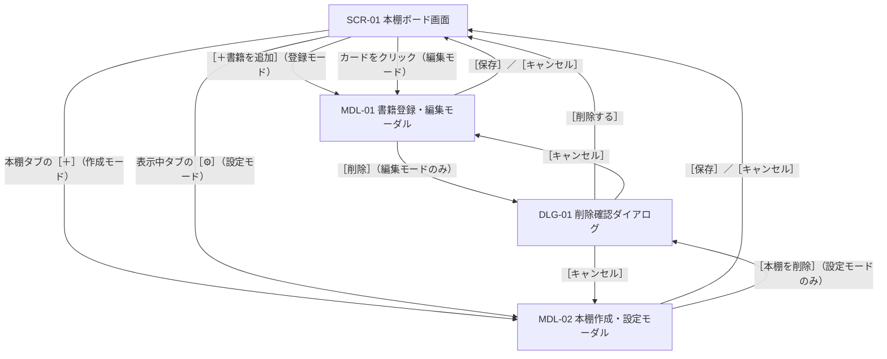

# 画面設計書：読書記録アプリ（本棚アプリ）

要件定義書（[requirements.md](requirements.md)）をもとに、画面の構成・レイアウト・操作を定める。

## 1. 概要

- 画面は「本棚ボード画面」の1ページのみとし、登録・編集・設定はモーダルで行う
- 対象はPCのデスクトップブラウザ（横幅1280px程度以上）とする（要件定義書7章）
- URLは `/` のみ。表示中の本棚はクエリパラメータ `?shelf=<本棚ID>` で表し、再読み込みしても同じ本棚を表示する。指定がない場合や存在しないIDの場合は、最初の本棚を表示する

## 2. 画面一覧

| ID | 名前 | 種類 | 主な役割 | 対応する要件 |
|---|---|---|---|---|
| SCR-01 | 本棚ボード画面 | ページ | 月間集計の表示、本棚の切り替え、検索・絞り込み、カードのドラッグ&ドロップ | 5.3, 5.4, 5.6, 5.8 |
| MDL-01 | 書籍登録・編集モーダル | モーダル | 書籍の新規登録・編集・削除、本棚間の移動、タグ付け | 5.1, 5.2, 5.5, 5.6, 5.7 |
| MDL-02 | 本棚作成・設定モーダル | モーダル | 本棚の作成・名前変更・削除 | 5.6 |
| DLG-01 | 削除確認ダイアログ | ダイアログ | 書籍・本棚を削除する前の確認 | 5.2, 5.6 |

## 3. 画面遷移



- ダイアログで［削除する］を押すと、元のモーダルも閉じてボード画面に戻る
- ［キャンセル］を押すと、ダイアログだけを閉じて元のモーダルに戻る
- 本棚を削除した場合は、残っている最初の本棚を表示する

## 4. SCR-01 本棚ボード画面

### 4.1 レイアウト

```
┌──────────────────────────────────────────────────────────────────┐
│ 📚 本棚アプリ                    [<] 2026年9月 [>]  読了 3冊  [グラフ ▼] │ ← A. ヘッダー／集計
├──────────────────────────────────────────────────────────────────┤
│ （グラフを開いたときだけ表示）                                        │
│   直近12ヶ月の読了冊数                                               │
│    3 ┤        █              █                                   │
│    2 ┤  █     █  █        █  █                                   │ ← A'. 12ヶ月グラフ
│    1 ┤  █  █  █  █     █  █  █  █                                │
│      └─10─11─12──1──2──3──4──5──6──7──8──9                        │
├──────────────────────────────────────────────────────────────────┤
│ [ 仕事用 ⚙ ] [ 趣味用 ] [ 漫画 ] [＋]                                 │ ← B. 本棚タブ
├──────────────────────────────────────────────────────────────────┤
│ 🔍[タイトル・著者名で検索     ] タグ[すべて ▼] [クリア]    [＋書籍を追加] │ ← C. ツールバー
├──────────────────────────────────────────────────────────────────┤
│ ┌── 未読 (4) ─────┐ ┌── 読書中 (2) ───┐ ┌── 読了 (12) ────┐        │
│ │ ┌─────────────┐ │ │ ┌─────────────┐ │ │ ┌─────────────┐ │        │
│ │ │[書影] タイトル │ │ │ │[書影] タイトル │ │ │ │[書影] タイトル │ │        │ ← D. ボード
│ │ │      #小説   │ │ │ │      #技術書 │ │ │ │      #小説   │ │        │
│ │ └─────────────┘ │ │ └─────────────┘ │ │ └─────────────┘ │        │
│ │ ┌─────────────┐ │ │                 │ │       ︙        │        │
│ │ │ ...         │ │ │                 │ │                 │        │
│ └─────────────────┘ └─────────────────┘ └─────────────────┘        │
└──────────────────────────────────────────────────────────────────┘
```

### 4.2 各エリアの表示と操作

| エリア | 表示内容 | 操作 |
|---|---|---|
| A. ヘッダー／集計 | アプリ名、指定月（初期値は今月）、その月の読了冊数（全本棚の合計） | ［<］［>］で前月・翌月に切り替える。［グラフ ▼］で12ヶ月グラフを開閉する |
| A'. 12ヶ月グラフ | 今月を含む直近12ヶ月の月別読了冊数の棒グラフ。0冊の月も表示する | 開閉状態はブラウザに保存し、次回も同じ状態で表示する（初期状態は閉じた状態） |
| B. 本棚タブ | すべての本棚を作成順に横に並べる。表示中のタブは強調表示し、［⚙］を付ける | タブをクリックすると本棚を切り替える（URLの `?shelf=` も更新）。［⚙］でMDL-02（設定モード）、［＋］でMDL-02（作成モード）を開く |
| C. ツールバー | キーワード入力欄、タグのセレクトボックス（「すべて」＋全タグ）、［クリア］、［＋書籍を追加］ | 入力すると即時に絞り込む。［クリア］で両方の条件を解除する。［＋書籍を追加］でMDL-01（登録モード）を開く |
| D. ボード | 「未読」「読書中」「読了」の3列。列見出しに冊数を表示する | カードをクリックするとMDL-01（編集モード）を開く。ドラッグ&ドロップは4.4を参照 |

- 本棚を切り替えても、検索・絞り込みの条件は維持する
- 絞り込み中は、列見出しの冊数を「表示中の冊数 / 全冊数」（例：`2 / 12`）の形で表示する

### 4.3 カードの表示内容

```
┌──────────────────────┐
│ ┌────┐  タイトル       │
│ │書影│  （2行まで。    │
│ │    │   超えたら…）   │
│ └────┘  #小説 #ミステリー│
└──────────────────────┘
```

| 項目 | 表示ルール |
|---|---|
| 書影 | 書影画像URLの画像を縮小して表示する。未入力、または画像を読み込めなかった場合はプレースホルダ（本のアイコン）を表示する |
| タイトル | 2行まで表示し、それを超える部分は「…」で省略する |
| タグ | 小さなラベルで表示する。表示しきれない場合は「+2」のように残りの数を表示する |

### 4.4 ドラッグ&ドロップの動き

| 操作 | 結果 |
|---|---|
| 別の列へドロップ | ステータスを変更し、ドロップした位置に置く。日付・評価は要件定義書5.3のルールで自動的に変更する |
| 同じ列の中でドロップ | 並び順を変更する |
| 絞り込み中に別の列へドロップ | ステータスを変更し、移動先の列の末尾に置く |
| 絞り込み中に同じ列の中でドロップ | 何もしない（元の位置に戻る） |

- ドロップした時点で保存する（確認はしない）
- ドラッグ中は、ドロップできる位置を線で表示する
- 保存に失敗した場合は、カードを元の位置に戻してエラーメッセージを表示する

## 5. MDL-01 書籍登録・編集モーダル

### 5.1 レイアウト

```
┌──────────── 書籍を編集 ────────────┐
│ 本棚       [仕事用            ▼]    │
│ タイトル＊ [                     ]  │
│ 著者名     [                     ]  │
│ 書影URL    [                     ]  │
│            ┌────┐                   │
│            │書影│ ← プレビュー        │
│            └────┘                   │
│ ステータス [読了              ▼]    │
│ 読書開始日 [2026/09/01]              │
│ 完了日     [2026/09/20]              │
│ 評価       ★★★★☆  [評価を消す]       │
│ タグ       [#小説 ×][#ミステリー ×]   │
│            [タグを入力・選択      ]  │
│ 感想メモ   ┌─────────────────────┐   │
│            │                     │   │
│            └─────────────────────┘   │
│                                      │
│ [削除]                [キャンセル][保存] │
└──────────────────────────────────────┘
```

### 5.2 モード

| モード | 開き方 | タイトル表示 | 違い |
|---|---|---|---|
| 登録モード | ［＋書籍を追加］ | 書籍を追加 | 本棚は表示中の本棚、ステータスは「未読」を初期値とする。［削除］は表示しない。保存すると、その本棚の「未読」列の末尾に追加する |
| 編集モード | カードをクリック | 書籍を編集 | 保存済みの値を表示する |

### 5.3 入力項目

| 項目 | 入力形式 | 必須 | 補足 |
|---|---|---|---|
| 本棚 | セレクトボックス | ○ | 変更して保存すると、移動先の本棚の同じステータスの列の末尾に移動する |
| タイトル | 1行テキスト | ○ | 未入力のまま保存しようとすると、エラーメッセージを表示する |
| 著者名 | 1行テキスト | － | |
| 書影URL | 1行テキスト | － | 入力するとプレビューを表示する。読み込めない場合はプレースホルダを表示する |
| ステータス | セレクトボックス（未読／読書中／読了） | ○ | 変更すると、日付・評価をドラッグ&ドロップと同じルールで自動的に変更する（要件定義書5.3） |
| 読書開始日 | 日付入力 | － | |
| 完了日 | 日付入力 | － | ステータスが「読了」のときのみ入力できる |
| 評価 | 星5つ（クリックで選択） | － | ステータスが「読了」のときのみ入力できる。［評価を消す］で未評価に戻す |
| タグ | 入力候補付きのテキスト入力 | － | 入力すると、入力した言葉を含む既存タグを候補に表示する（表記ゆれを無視した部分一致。例：「ミステリ」→「ミステリー」「ミステリー小説」）。候補から選ぶか、Enterで追加する。Enterの場合、表記ゆれだけが違う既存タグ（例：「ruby」に対する「Ruby」）があればそれを付け、なければ新しいタグを作る（[database.md](database.md) 3.3.1）。［×］で外す |
| 感想メモ | 複数行テキスト | － | |

### 5.4 操作

- ［保存］：入力内容をまとめて保存し、モーダルを閉じる
- ［キャンセル］、モーダルの外側のクリック、Escキー：保存せずに閉じる。変更がある場合は「変更を破棄しますか？」と確認する
- ［削除］：DLG-01を開く（編集モードのみ）

## 6. MDL-02 本棚作成・設定モーダル

```
┌─────── 本棚の設定 ───────┐
│ 本棚名＊ [仕事用        ] │
│                          │
│ [本棚を削除]  [キャンセル][保存] │
│ ※ 書籍が残っているため削除できません │
└──────────────────────────┘
```

| モード | 開き方 | 内容 |
|---|---|---|
| 作成モード | 本棚タブの［＋］ | タイトルは「本棚を作成」。［本棚を削除］は表示しない。保存すると、作成した本棚に切り替える |
| 設定モード | 表示中タブの［⚙］ | タイトルは「本棚の設定」。本棚名を変更できる |

- 本棚名が未入力の場合は保存できない（エラーメッセージを表示する）
- ［本棚を削除］は、次の場合に押せない状態にし、その下に理由を表示する
  - 書籍が1冊以上残っている：「書籍が残っているため削除できません。別の本棚へ移動するか削除してください」
  - 最後の1つの本棚である：「本棚が1つしかないため削除できません」

## 7. DLG-01 削除確認ダイアログ

書籍と本棚の削除で共通の画面を使い、文言だけを変える。

| 対象 | メッセージ |
|---|---|
| 書籍 | 「『{タイトル}』を削除しますか？この操作は取り消せません。」 |
| 本棚 | 「本棚『{本棚名}』を削除しますか？この操作は取り消せません。」 |

- ボタンは［キャンセル］と［削除する］（赤色）。初期フォーカスは［キャンセル］に置く

## 8. 共通のUIルール

| 状況 | 表示 |
|---|---|
| 列にカードがない | 列の中に「書籍はありません」と薄く表示する |
| 絞り込み結果が0件 | ボードの上に「条件に一致する書籍はありません」と表示する |
| データ読み込み中 | ボード・集計の位置に読み込み中の表示を出す |
| 保存・削除に失敗 | 画面右下に一定時間エラーメッセージを表示する。モーダルは閉じずに入力内容を残す |
| 入力エラー | 該当する入力欄の下に赤字でメッセージを表示する |

## 9. 画面設計上の判断とその理由

| 論点 | 採用した設計 | 検討した他の案 | 採用理由 |
|---|---|---|---|
| 画面の構成 | 1ページ＋モーダル | 集計画面や書籍詳細画面を別ページにする | 本棚アプリの操作はボードが中心で、ページを移動すると今見ている本棚や絞り込みの状態から離れてしまう。前回のTrello風アプリと同じ構成で、作り方の見通しも立てやすい |
| 集計の置き場所 | ボードの上部に1行で表示し、グラフは折りたたむ | 別ページ（/stats）／グラフを常に表示 | 今月の冊数はボードを開くたびに目に入るようにしたい。一方で、グラフを常に表示するとボードが狭くなるため、見たいときだけ開けるようにした |
| グラフの開閉状態 | ブラウザに記憶する | 毎回閉じた状態に戻す | グラフをよく見る人は、毎回開く手間がかからないようにするため |
| 本棚の切り替え | ボード上部のタブ | 左サイドバー／ドロップダウン | 本棚の数は少ない想定なので、1クリックで切り替えられるタブが使いやすい。サイドバーにするとボードの横幅が狭くなる |
| 本棚の名前変更・削除の入口 | 表示中のタブの［⚙］から設定モーダルを開く | タブの右クリックメニュー／本棚管理の専用画面 | 右クリックメニューは操作があることに気づきにくい。［⚙］なら見てすぐわかり、対象の本棚も明確になる |
| 新規登録の方法 | ［＋書籍を追加］ボタンで登録モーダルを開く | 未読列の下でタイトルだけ入力する | 編集モーダルと同じフォームを使い回せるので、作る画面が少なくて済む。登録時に著者名やタグもまとめて入力できる |
| カードの表示内容 | 書影・タイトル・タグ | 著者名や評価・日付も表示する | カードに情報を詰め込みすぎると、ボード全体が見にくくなる。タグを表示するのは、絞り込みの結果になぜその本が出たのかがわかるようにするため |
| 検索・絞り込みの反映 | 入力と同時に絞り込む（検索ボタンなし） | 検索ボタンを押して絞り込む | 表示中の本棚の中だけを対象にするため件数が少なく、入力のたびに絞り込んでも負担にならない。結果がすぐ見えるほうが使いやすい |
| 絞り込み中のドロップ | 別の列へのドロップは末尾に置く。同じ列の中では何もしない | ドロップした位置に置く | 非表示のカードがあると、見えている位置と実際の並び順が一致しないため（要件定義書10章） |
| ステータスの変更方法 | ドラッグ&ドロップに加えて、編集モーダルのセレクトボックスでも変更できる | ドラッグ&ドロップのみ | 要件定義書5.2で「すべての項目を編集できる」としたため。日付の自動入力ルールは、どちらの方法でも同じにする |
| 完了日の入力可否 | ステータスが「読了」のときのみ入力できる | いつでも入力できる | 読了以外の本に完了日があると、評価と同じく矛盾が生じ、集計にも影響するため |
| 保存のタイミング | モーダルは［保存］でまとめて保存し、ドラッグ&ドロップはドロップ時に保存する | モーダルも項目ごとに自動保存 | モーダルでは複数の項目をまとめて入力することが多く、途中の状態で保存されないほうがわかりやすい。ドラッグ&ドロップは1回の操作で完結するので、すぐ保存する |
| 表示中の本棚の保持 | URLのクエリ `?shelf=<id>` に持たせる | 画面の状態だけで持つ | 再読み込みしても同じ本棚が表示されるようにするため。ブラウザの戻る・進むとも合わせやすい |
| 削除確認ダイアログ | 書籍と本棚で共通の画面を使う | それぞれ別の画面を作る | 役割が同じなので、1つにまとめれば作る量が減り、見た目や操作もそろう |
| 本棚が削除できない場合の表示 | 削除ボタンを押せない状態にし、理由を表示する | ボタンを押した後にエラーを表示する | 押す前に削除できないことと、その理由がわかるほうが親切なため |
