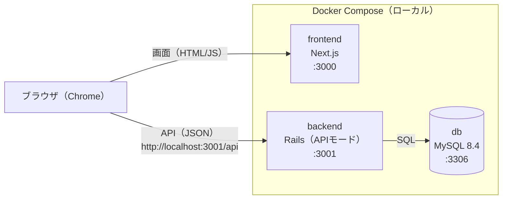

# 技術スタック詳細：読書記録アプリ（本棚アプリ）

要件定義書（[requirements.md](requirements.md) 9章）で決めた技術スタック（Next.js / Ruby on Rails / MySQL）について、バージョン・ライブラリ・開発環境の構成を定める。バージョンは 2026-09-26 時点で確認した。

## 1. 全体構成



- ブラウザは Next.js から画面を受け取り、APIは Rails に直接リクエストする（Next.js のサーバーを経由しない。3.2）
- 3つのサービスは Docker Compose でまとめて起動する（要件定義書7章）

## 2. バージョン一覧

| 区分 | 名前 | バージョン | 備考 |
|---|---|---|---|
| 実行環境 | Node.js | 24（LTS） | Next.js 16 は 20.9 以上が必要 |
| 実行環境 | Ruby | 4.0 | |
| 実行環境 | MySQL | 8.4（LTS） | 2032年4月までサポート |
| フロントエンド | Next.js | 16.3 | App Router を使う |
| フロントエンド | React | 19.3 | |
| フロントエンド | TypeScript | 6.0 | 要件定義書の 5.9 から変更（8章） |
| フロントエンド | Tailwind CSS | 4.3 | |
| バックエンド | Ruby on Rails | 8.1 | APIモード |

- 表のバージョンはメジャー・マイナーまでを決める。パッチバージョンは環境構築の時点の最新を使い、`package-lock.json` / `Gemfile.lock` で固定する
- Docker イメージは `node:24-slim`、`ruby:4.0-slim`、`mysql:8.4` を使う

## 3. フロントエンド（frontend/）

### 3.1 構成

| 項目 | 採用するもの |
|---|---|
| ルーター | App Router（`app/` ディレクトリ） |
| パッケージ管理 | npm |
| スタイル | Tailwind CSS（モックアップの配色・余白をもとにする） |

### 3.2 レンダリング方式

- ページは `/` の1つだけで（画面設計書1章）、`app/page.tsx` から本棚ボードを表示する
- ボードや操作に関わる部分はクライアントコンポーネント（`"use client"`）とし、データはブラウザから Rails のAPIを直接呼んで取得する（CSR）
- サーバー側でデータを取得して表示する方式（SSR）は使わない

### 3.3 ライブラリ

| 用途 | ライブラリ | バージョン | 使う場面 |
|---|---|---|---|
| データ取得・保存 | TanStack Query（`@tanstack/react-query`） | 5.x | APIの呼び出し、取得したデータの保持（キャッシュ）、保存後の取り直し、ドラッグ&ドロップの楽観的更新（先に画面を変え、失敗したら戻す） |
| ドラッグ&ドロップ | dnd-kit（`@dnd-kit/core`、`@dnd-kit/sortable`） | 6.x / 10.x | ボードの列の間・列の中でのカードの移動 |
| グラフ | Recharts | 3.x | 12ヶ月の読了冊数の棒グラフ |

- APIの呼び出しは、ブラウザ標準の `fetch` を包んだ小さな関数（`lib/api.ts`）にまとめる。エラーの形式（api.md 3.2）の読み取りもここで行う
- APIのレスポンスの型は、api.md をもとに TypeScript で定義する（キーはスネークケースのまま。api.md 9章）
- フォームは項目が少ないため、フォーム用のライブラリは使わず React の state で扱う
- 日付は `YYYY-MM-DD` の文字列のまま扱い、日付用のライブラリは使わない
- タグ名の正規化（database.md 3.3.1）は、`String.prototype.normalize("NFKC")` と、カタカナをひらがなに変える自作の関数で行う

### 3.4 ディレクトリ構成（予定）

```
frontend/
├── app/
│   ├── layout.tsx
│   ├── page.tsx            # 本棚ボード画面（SCR-01）
│   └── providers.tsx       # TanStack Query の設定
├── components/
│   ├── board/              # ボード・列・カード
│   ├── modals/             # MDL-01、MDL-02、DLG-01
│   └── stats/              # 月間集計・グラフ
├── lib/
│   ├── api.ts              # APIの呼び出し
│   ├── types.ts            # APIの型定義
│   └── tag.ts              # タグ名の正規化
└── tests/                  # Vitest のテスト
```

## 4. バックエンド（backend/）

### 4.1 構成

| 項目 | 採用するもの |
|---|---|
| 作成方法 | `rails new backend --api --database=mysql` |
| ポート | 3001（Next.js の 3000 と重ならないようにする） |
| タイムゾーン | `config.time_zone = "Tokyo"`。「今日の日付」は `Date.current` で求める（api.md 1章） |
| JSONの組み立て | `app/serializers/` に書籍・本棚などの形（api.md 3.3）を組み立てるクラスを置き、コントローラーから使う |
| エラー処理 | `ApplicationController` の `rescue_from` で、api.md 3.2 の形式に変換して返す |

### 4.2 gem

| 用途 | gem | 備考 |
|---|---|---|
| MySQL接続 | mysql2 | `rails new` で入る |
| CORS | rack-cors | `http://localhost:3000` からのリクエストを許可する（api.md 1章） |
| テスト | rspec-rails | モデル・リクエスト（API）のテストを書く |
| テストデータ | factory_bot_rails | |
| コードチェック | rubocop-rails-omakase | `rails new` で入る Rails 標準の設定 |

- タグ名の正規化は、Ruby 標準の `unicode_normalize(:nfkc)`、`downcase`、`tr("ァ-ヶ", "ぁ-ゖ")` で行い、フロントエンドと同じ結果になるようにテストで確認する

## 5. データベース

| 項目 | 設定 |
|---|---|
| バージョン | MySQL 8.4（LTS） |
| 文字コード | `utf8mb4`、照合順序は `utf8mb4_0900_ai_ci`（MySQL 8.4 の標準） |
| 例外 | `tags.normalized_name` のみ `utf8mb4_bin`（database.md 3.3） |
| データの保存先 | Docker のボリューム（`db-data`）。コンテナを作り直してもデータは消えない（要件定義書7章） |

- テーブルの作成は Rails のマイグレーションで行い、CHECK制約は `add_check_constraint` で定義する（database.md 4.1）

## 6. Docker Compose の構成

| サービス | イメージ | ポート | 役割 |
|---|---|---|---|
| db | `mysql:8.4` | 3306 | データベース。`db-data` ボリュームに保存する |
| backend | `ruby:4.0-slim` をもとにした Dockerfile | 3001 | Rails のAPIサーバー。起動時に `bin/rails db:prepare` を実行する |
| frontend | `node:24-slim` をもとにした Dockerfile | 3000 | Next.js の開発サーバー |

- `docker compose up` の1コマンドで3つとも起動する。backend は db の起動（ヘルスチェック）を待ってから起動する
- ソースコードはコンテナにマウントし、編集がすぐ反映されるようにする
- 接続先などの設定は環境変数で渡す

| 環境変数 | サービス | 例 |
|---|---|---|
| `DB_HOST` / `DB_USERNAME` / `DB_PASSWORD` | backend | `db` / `root` / （`.env` で設定） |
| `CORS_ORIGINS` | backend | `http://localhost:3000` |
| `NEXT_PUBLIC_API_BASE_URL` | frontend | `http://localhost:3001/api` |

- パスワードは `.env` に書き、`.env` はGitに含めない（`.env.example` だけをコミットする）

## 7. 開発ツール・テスト・CI

| 対象 | 種類 | ツール |
|---|---|---|
| フロントエンド | コードチェック | ESLint（`eslint-config-next`）＋ typescript-eslint |
| フロントエンド | 整形 | Prettier |
| フロントエンド | テスト | Vitest ＋ React Testing Library |
| バックエンド | コードチェック・整形 | RuboCop（rubocop-rails-omakase） |
| バックエンド | テスト | RSpec ＋ FactoryBot |
| 共通 | CI | GitHub Actions |

- テストで重点的に確かめること
  - バックエンド：ステータス変更時の日付・評価のルール、並び順の振り直し、タグの表記ゆれの判定、各APIのレスポンスとエラー
  - フロントエンド：タグ名の正規化、APIの呼び出しとエラーの読み取り、主要なコンポーネントの表示
- CI は PR を作成・更新したときに、frontend（ESLint・型チェック・Vitest・ビルド）と backend（RuboCop・RSpec）を実行する。CLAUDE.md のルール（CIが通ってからマージする）に使う
- ブラウザを自動操作するテスト（E2Eテスト）は、MVPの範囲外とする

## 8. 設計上の判断とその理由

| 論点 | 採用した設計 | 検討した他の案 | 採用理由 |
|---|---|---|---|
| TypeScript のバージョン | 6.0 | 5.9（要件定義書の記載）／7.0（最新） | 5.9 のあとに 6.0 が出ており、新しく始めるなら 6.0 のほうがよい。7.0 は Go で書き直されて高速だが、ESLint で TypeScript を扱う typescript-eslint がまだ対応していない（6.1 未満のみ対応）ため見送った |
| MySQL のバージョン | 8.4（LTS） | 8.0／9.7（LTS） | 8.0 は2026年4月にサポートが終了した。8.4 は 8.0 の後継の長期サポート版で、資料が多く、DB設計の内容（CHECK制約など）もそのまま使える。9.7 は新しすぎて資料が少なく、今回の設計で必要な新機能もない |
| Node.js のバージョン | 24（LTS） | 26 | 24 は長期サポート中で、ライブラリの対応も安定している。26 は長期サポートに入ったばかりのため見送った |
| Ruby のバージョン | 4.0 | 3.4 | 最新の安定版で、Rails 8.1 が対応している。長く使えるように最新を選んだ |
| Next.js のルーター | App Router | Pages Router | 現在の Next.js の標準で、新しく作るならこちらが推奨されている。学習する価値も高い |
| レンダリング方式 | クライアントコンポーネントでAPIを直接呼ぶ（CSR） | サーバーコンポーネントでデータを取得する（SSR） | 画面はドラッグ&ドロップや絞り込みなど操作が中心で、ログインも検索エンジン向けの対策も不要なため、SSRの利点が小さい。SSRにすると、Next.js のサーバーから見た Rails の場所（コンテナ間の `backend:3001`）と、ブラウザから見た場所（`localhost:3001`）の2つを扱う必要があり、構成が複雑になる |
| データ取得のライブラリ | TanStack Query | SWR／fetch と useState のみ | 保存後の取り直し（api.md 8章）や、ドラッグ&ドロップで先に画面を変えて失敗したら戻す動き（画面設計書4.4）を、用意された仕組みで書ける。現場でも広く使われている |
| ドラッグ&ドロップ | dnd-kit（`@dnd-kit/core` / `@dnd-kit/sortable`） | `@hello-pangea/dnd`／Pragmatic drag and drop／`@dnd-kit/react`（新版） | 列の間の移動と列の中での並べ替えの両方ができ、利用例や資料が最も多い。後継の `@dnd-kit/react` はまだ 1.0 未満のため、安定している現行版を使う |
| グラフ | Recharts | Chart.js（react-chartjs-2）／自作のSVG | Reactのコンポーネントとして書け、棒グラフ1つなら設定も少ない |
| Rails の構成 | APIモード | フルスタック | 画面は Next.js で作るため（api.md 9章） |
| JSONの組み立て | 自作のシリアライザクラス | Jbuilder／外部のシリアライザgem | レスポンスの形は数種類だけで、Rubyのクラスで書けば仕組みが見えやすく、テストもしやすい |
| Rails のテスト | RSpec ＋ FactoryBot | Minitest（Rails標準） | 日本のRailsの現場で最も使われており、ポートフォリオとしても評価されやすい |
| フロントエンドのテスト | Vitest ＋ React Testing Library | Jest | 設定が少なく動作が速い。TypeScript をそのまま扱える |
| E2Eテスト | MVPでは行わない | Playwright で主要な操作を自動テストする | 1ページの小さなアプリで、画面の操作は手動で確認できる。まずはAPIとロジックのテストを優先する |
| CI | GitHub Actions で Lint とテストを実行する | CIなし | CLAUDE.md で「CIやビルドが通ることを確認してからマージする」としているため、確認を自動にする |
